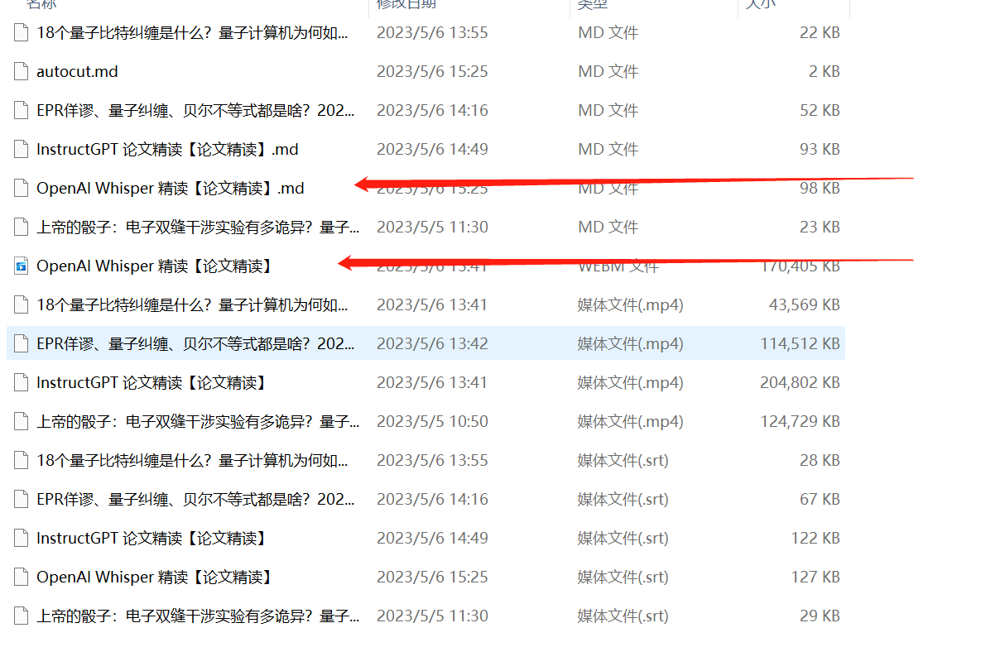

# ChatVideo


ChatVideo是基于ChatGPT的视频播放项目，可以将视频分割成不同的部分，并基于用户的提问，找到视频相应的位置进行播放


本项目是基于autocut的结果，使用ChatGPT进行功能扩展，所以请先安装autocut。


[点击这里跳转到autocut项目](https://github.com/mli/autocut)


### 准备工作

安装autocut，使用```autocut -d your_path```命令，生成对应的语音识别MD文件。本项目只对生成对应的MD文件的视频有效。

构建时间可能很长，取决于机器配置，是否使用GPU。

### 使用方法
1. 克隆项目
```
git clone https://github.com/MeiPixel/ChatVideo.git
cd ChatVideo
```

2. 构建项目数据库

```
python build.py -path=video_path  -api_key=openai_api_key
```


3. 运行项目
```
python run.py -path=video_path  -api_key=openai_api_key
```

结果预览：
